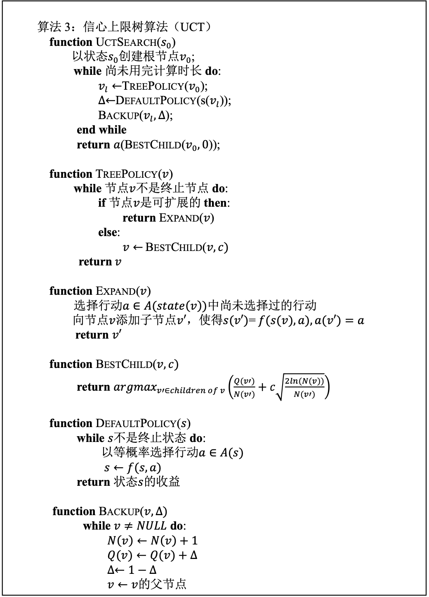

<font size = "6em" ><bold>**实验3: Connect4** &nbsp;&nbsp;</bold></font> <small>2021080070 计14 韩佑硕 </small> 

# **Pre requisite**
## Judge.h, Judge.cpp
userWin & computerWin : 判断谁赢  
isTie 必须在调用userWin和computerWin之后

## **Point.h**
棋盘中左上角为坐标原点.纵向为x坐标轴,横向为y坐标轴

## **Strategy.h, Strategy.cpp**
策略模块中动态定义的对象必须由策略模块中的函数来释放


# **实现方法**
本人采用 Monte Carlo Tree Search + Upper Confidence Bounds。  
下面给MCTS的四大步骤给出了详细的解析。

## **1. Selection Strategy**
---
### **1-1. UCT**
已经说明了采用UCT方法，因此selection strategy 就是 UCB.
在UCT中，孩子节点k的选择是由这个方程决的  
 $k \in argmax_{i\in I}(v_i + C \times \sqrt{ \ln n_p\over n_i})$
其中的参数设置如下
- $v_i$ : value of the node i → 该节点战胜的概率
- $n_i$ : visit count of i → 该节点被访问的次数
- $n_p$ : visit count of p. → 父节点被访问的次数
- $C$: coefficient, which has to be tuned experimentally。 本人一开始的值设置成alphago 使用的常数 $\sqrt 2$

### **1-2. 代码实现 
#### **1-2-1. tree_policy**
___
`is_expandable`接口函数判断该节点能否扩展。  
`is_terminal`接口函数判断该节点是否为终止节点。

返回的情况只有两种
1. `v`是terminal state
2. `v`是刚刚expanded
在下面(Rollout strategy)会看到两种情况处理的不一样。

#### **1-2-2.bestchild**
___ 
对应的代码部分为`UCT.h`中 `bestchild`部分,  
其中用到的成员变量为`children`。  
`bestchild`函数是只有该节点再也不可expand的时候才会被调用。  
主逻辑就是上面的公式的代码实现，实现中要注意孩子一次也没有被访问的情况。此时，就会访问那个节点。  
## **2. Expansion Strategy**
---
首先，我选的expansion strategy是 “expand one node per simulated game.”
且是否可以扩展的指标为，在这次UCT中，是否还没存在从节点v可以走的棋盘。("The expanded node corresponds to the first position encountered that was not stored yet")  
如果所有的能走的棋盘存在，则 unexpandable, 否则 expandable。  

### **2-2. 代码实现**
在`Node`中引入了`int expandables` 参数，用来记录可以走的棋盘的盘数。
#### **2-2-1. expand(v)**
`get_chance()` 接口函数用来判断当前要扩展的棋盘是哪方的棋盘.  
`set_parent()` 接口函数用设置所生成的孩子节点的父节点。
**注意点**
* 不是所有`Node`有`column`个可扩展的孩子节点，要检查`top`.  
* expand child node 的顺序 : 把棋子放在最左有效列(`top_[i]`>0)后生成的棋盘为`children[i]`对应的`Node`.  
```c++
    for(int i = 0; i < column; i++){
        if(top_[i] > 0){
            //...
        }
    }
```
* 需要考虑不可落子点！ -> 引入`step`变量, 用到`get_no_y()`, `get_no_x()`等接口.  
## **3. Rollout Policy(Simulation strategy, Default Policy)**
---
一开始所选取的default policy 是两个选手都随机放棋子。  
后来发现，一般而言，在棋盘中间放置的棋子对该选手获胜起到更积极的作用，因此给每列分配一定的权重，从而反应了这一点。  
下面为上述三种default policy 的代码实现。
### **3-2. 代码实现**
首先，rollout函数返回delta值，是该simulation的结果。由于connect4 可以出现平局的情况，对`result`做了一些调整，如果`simulation`比赛获胜$R_k$=1，平局则0，输则-1。  
调用该函数(`rollout()`)的节点可分 terminal 和 non-terminal 两种。  
其中 terminal state 的节点不用做simulation，直接判断谁输谁赢能决定delta值。  
但另外一种情况则需要simulation下面为不同simulation策略的解释。  
#### **3-2-1. rollout(random)**

#### **3-2-2. rollout(middle)**

#### **3-2-3. rollout(7)**

## **4. Back Propagation**
---
节点的 `value` 为该节点`result`的平均值。即，  
$v_L = {(\sum_k R_k) \over n_L}$
### **4-2. 代码实现**
#### **4-2-1. backup**
用到的函数只是`Node`的接口函数而已。 
要注意的是不用考虑各节点的`chance`值，每次迭代给`delta`值乘以-1就行了。

## **整体流程**
___
从如下基本的UCT框架受到启发，  

具体的流程图为如下
<!-- ... -->

## **可优化空间**
### **欠缺**
1. 每个`Node` instance 拥有各自的`board_`，占用(`sizeofInt` * `row` * `column`) bytes of memory. 虽然这个值本身不是很大的，但是每次生成Node都需要进行board的Deep Copy，占用不少部分的资源。

2. 在`bestchild`中，如果`value_`值相同，就选择在`children`中靠前的那个节点。但这里也可以选择方棋子更靠中间的棋盘。
   
### **优化方案**
1. 第一个问题可以用红黑树来优化。
2. 在`bestchild`中引入`dist`，指当次下的落子里中心列的距离。在`value`相同的情况下，选择`dist`更小的`child`.
3. 

# **总结与收获**
在实现算法的过程中，有很多东西牵扯到算法的效率，其中最恼火的是以下几点。  
## **什么时候判断该节点是terminal?**
在tree_policy中，每次迭代都要检查目前节点是否为terminal state。因此，

# **References**
___
* 教学团队提供的《蒙特卡洛博弈方法》
* Chaslot, Guillaume & Winands, Mark & Herik, H. & Uiterwijk, Jos & Bouzy, Bruno. (2008). Progressive Strategies for Monte-Carlo Tree Search. New Mathematics and Natural Computation. 04. 343-357. 10.1142/S1793005708001094. 
<https://www.researchgate.net/publication/23751563_Progressive_Strategies_for_Monte-Carlo_Tree_Search>

